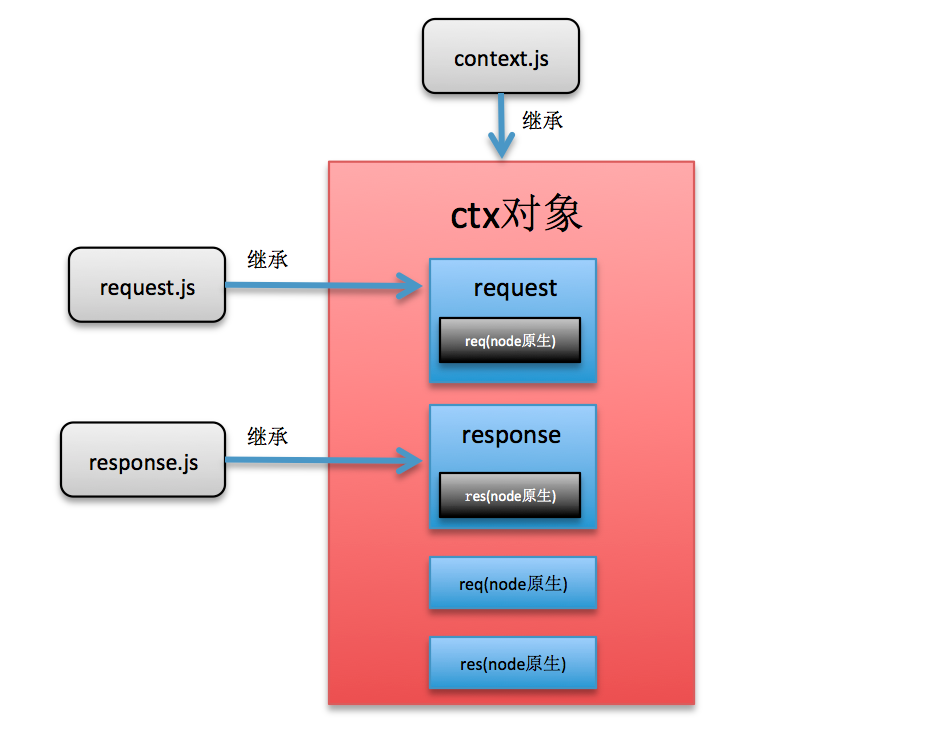

可以看到，最主要的是增加了`createContext`方法，基于我们之前创建的`context` 为原型，使用`Object.create(this.context)`方法创建了`ctx`，并同样通过`Object.create(this.request)`和`Object.create(this.response)`创建了`request/response`对象并挂在到了`ctx`对象上面。此外，还将原生`node`的`req/res`对象挂载到了`ctx.request.req/ctx.req`和`ctx.response.res/ctx.res`对象上。

回过头去看我们之前的`context/request/response.js`文件，就能知道当时使用的`this.res`或者`this.response`之类的是从哪里来的了，原来是在这个`createContext`方法中挂载到了对应的实例上。一张图来说明其中的关系：

构建了运行时上下文`ctx`之后，我们的`app.use`回调函数参数就都基于`ctx`了。

**下面一张图描述了`ctx`对象的结构和继承关系**：
